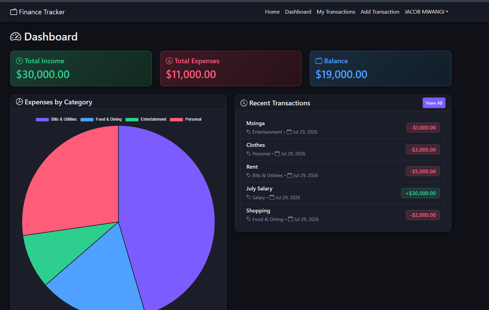
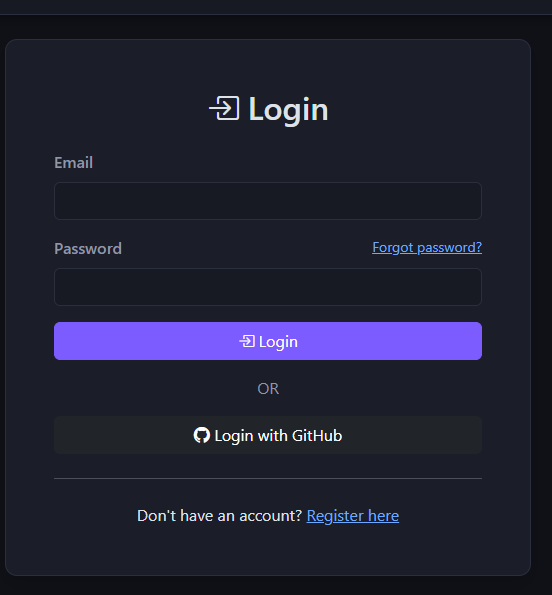
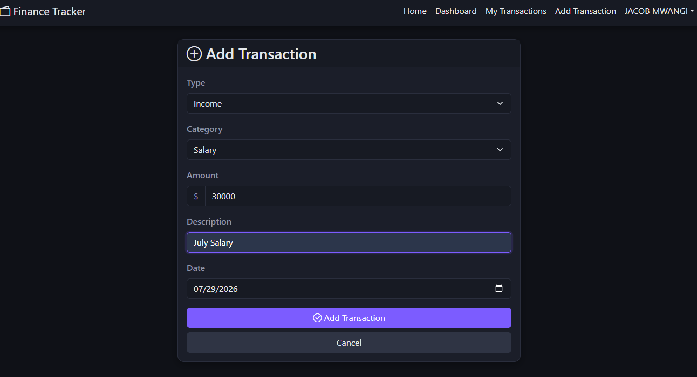

# 💰 Finance Tracker

A full-stack personal finance management application built to give users a private, secure place to track income and expenses — with production-grade authentication, not just a login form.

**Live App:** [https://your-app.vercel.app](https://your-app.vercel.app)
**API:** [https://your-api.onrender.com](https://your-api.onrender.com)


---

## Table of Contents

- [About](#about)
- [Features](#features)
- [Tech Stack](#tech-stack)
- [Architecture](#architecture)
- [Authentication & Security](#authentication--security)
- [Screenshots](#screenshots)
- [Getting Started](#getting-started)
- [Environment Variables](#environment-variables)
- [API Reference](#api-reference)
- [Project Structure](#project-structure)
- [Deployment](#deployment)
- [Lessons Learned](#lessons-learned)
- [Roadmap](#roadmap)
- [License](#license)

---

## About

Most personal finance is tracked across a mix of bank apps, mental math, and receipts stuffed in a drawer. Finance Tracker gives that a single home: a fast, private dashboard for logging transactions, seeing spending broken down by category, and understanding your financial position without spreadsheets.

This project was also an exercise in building the parts of an app that portfolio projects often skip — real email verification, a proper password reset flow, and token-based authentication designed the way a production system would handle it, not the simplest thing that could possibly work.

Currency is displayed in Kenyan Shillings (Ksh.) throughout, reflecting its intended primary audience.

## Features

- 🔐 **Email/password authentication** with mandatory email confirmation before an account can log in
- 🔑 **GitHub OAuth** as a one-click alternative (auto-verified, since GitHub already confirms emails)
- 🔄 **Forgot / reset password** flow with expiring, single-use reset links
- ♻️ **JWT access tokens + rotating httpOnly refresh tokens** — no long-lived tokens sitting in `localStorage`
- 💵 **Full CRUD on transactions** — income and expenses, categorized, with a delete confirmation step
- 📊 **Spending breakdown** — interactive pie chart of expenses by category (Chart.js)
- 📈 **Live dashboard** — running totals for income, expenses, and balance, plus recent activity
- 🔒 **Fully private by design** — every transaction is scoped to its owner server-side; there is no shared or public view of anyone's financial data
- 🌙 **Dark UI** — custom dark theme, not just Bootstrap defaults with the brightness turned down
- 📱 **Responsive** — usable on desktop and mobile

## Tech Stack

**Frontend**
- React 18 (Vite)
- React Router
- Axios
- Chart.js / react-chartjs-2
- Bootstrap 5 (custom dark theme)

**Backend**
- Node.js / Express
- MongoDB with Mongoose
- Passport.js (Local + GitHub OAuth strategies)
- JSON Web Tokens (`jsonwebtoken`)
- bcrypt.js for password hashing
- Nodemailer for transactional email

**Infrastructure**
- MongoDB Atlas — database
- Render — API hosting
- Vercel — frontend hosting

## Architecture

```
┌────────────────────┐          HTTPS / JSON           ┌──────────────────────┐
│   React SPA          │ ───────────────────────────────▶ │   Express REST API     │
│   (Vercel)            │ ◀─────────────────────────────── │   (Render)              │
│                       │                                   │                         │
│  Access token:        │   Access token: response body     │  - Passport.js          │
│  in-memory only       │   Refresh token: httpOnly cookie   │  - JWT sign/verify      │
│                       │   (SameSite=None, Secure,          │  - Mongoose models      │
│                       │   path=/api/auth)                  │  - Nodemailer           │
└────────────────────┘                                     └───────────┬─────────────┘
                                                                          │
                                       ┌──────────────────┐              │
                                       │  MongoDB Atlas     │◀────────────┘
                                       └──────────────────┘
                                                │
                                       ┌──────────────────┐
                                       │  Email provider    │
                                       │  (SMTP)             │
                                       └──────────────────┘
```

Frontend and backend are fully decoupled — no server-side rendering, no shared session state. Either side can be redeployed or scaled independently.

## Authentication & Security

This was the part of the project I spent the most time getting right.

**Token strategy.** Rather than a single long-lived JWT (simple, but a security liability if leaked) or a plain session cookie (fine, but couples the frontend tightly to the backend's session store), the app uses a two-token pattern:

| Token | Lifetime | Storage | Purpose |
|---|---|---|---|
| Access token | 15 minutes | In-memory JS variable only | Sent on every API request; short-lived to limit damage if ever exposed |
| Refresh token | 7 days | `httpOnly`, `Secure` cookie | Invisible to JavaScript; used only to silently mint new access tokens |

On load, the app exchanges the refresh cookie for a fresh access token before rendering anything behind auth. If an access token expires mid-session, an Axios interceptor catches the resulting `401`, refreshes silently, and retries the original request — the user never notices. Refresh tokens are also tracked per-user in the database and rotated on every use, so a captured token becomes worthless the next time the real user's session refreshes.

**Email verification.** New accounts are created in an unverified state and can't log in until they click a confirmation link. The link contains a cryptographically random token; only its SHA-256 hash is stored in the database, so a database leak alone can't be used to forge valid verification or reset links. GitHub sign-ups skip this step, since GitHub has already verified the email on its end.

**Password reset.** Follows the same hashed-token pattern, with a 1-hour expiry. Requesting a reset for an email that isn't registered returns the same response as a successful request, to avoid leaking which addresses have accounts. Successfully resetting a password also invalidates any existing refresh token, forcing re-authentication.

**Data isolation.** Every transaction query is scoped server-side to `req.user.id` — there's no client-supplied identifier that could be swapped to access someone else's data, and no shared/public view of any user's transactions.

## Screenshots

| Dashboard | Login |
|---|---|
|  |  |

| Add Transaction | Password Reset |
|---|---|
|  |  |

## Getting Started

### Prerequisites

- Node.js v18+
- A [MongoDB Atlas](https://www.mongodb.com/) cluster (free tier works)
- A [GitHub OAuth App](https://github.com/settings/developers)
- An SMTP provider for transactional email (e.g. [Resend](https://resend.com), [Mailgun](https://www.mailgun.com), or Gmail with an app password)

### Backend

```bash
git clone https://github.com/yourusername/finance-tracker.git
cd finance-tracker
npm install
```

Create a `.env` file (see [Environment Variables](#environment-variables)), then:

```bash
npm run dev
```

API runs at `http://localhost:3000`.

### Frontend

```bash
git clone https://github.com/yourusername/finance-tracker-client.git
cd finance-tracker-client
npm install
```

Create a `.env` file, then:

```bash
npm run dev
```

App runs at `http://localhost:5173`.

## Environment Variables

**Backend**

| Variable | Description |
|---|---|
| `MONGODB_URI` | MongoDB Atlas connection string |
| `ACCESS_TOKEN_SECRET` | Signing secret for access tokens |
| `REFRESH_TOKEN_SECRET` | Signing secret for refresh tokens (must differ from above) |
| `GITHUB_CLIENT_ID` / `GITHUB_CLIENT_SECRET` | GitHub OAuth App credentials |
| `GITHUB_CALLBACK_URL` | e.g. `http://localhost:3000/api/auth/github/callback` |
| `CLIENT_URL` | Frontend URL — used for CORS and email links |
| `EMAIL_HOST` / `EMAIL_PORT` / `EMAIL_USER` / `EMAIL_PASS` / `EMAIL_FROM` | SMTP config for verification and reset emails |
| `PORT` | Defaults to `3000` |
| `NODE_ENV` | `development` or `production` — controls cookie security flags |

**Frontend**

| Variable | Description |
|---|---|
| `VITE_API_URL` | Base URL of the backend API |

## API Reference

All routes are prefixed with `/api`. Protected routes require `Authorization: Bearer <accessToken>`.

### Auth

| Method | Endpoint | Auth | Description |
|---|---|---|---|
| `POST` | `/auth/register` | No | Create an unverified account, sends confirmation email |
| `GET` | `/auth/verify-email?token=` | No | Confirms an account |
| `POST` | `/auth/resend-verification` | No | Re-sends the confirmation email |
| `POST` | `/auth/login` | No | Log in (fails if unverified); returns access token, sets refresh cookie |
| `POST` | `/auth/forgot-password` | No | Sends a password reset email |
| `POST` | `/auth/reset-password` | No | Sets a new password from a valid reset token |
| `POST` | `/auth/refresh` | Refresh cookie | Exchanges the refresh cookie for a new access token |
| `POST` | `/auth/logout` | Refresh cookie | Revokes the refresh token, clears the cookie |
| `GET` | `/auth/me` | Yes | Returns the current authenticated user |
| `GET` | `/auth/github` / `/auth/github/callback` | No | GitHub OAuth flow |

### Transactions

| Method | Endpoint | Auth | Description |
|---|---|---|---|
| `GET` | `/transactions` | Yes | List the current user's transactions |
| `POST` | `/transactions` | Yes | Create a transaction |
| `GET` | `/transactions/:id` | Yes | Get a single transaction |
| `PUT` | `/transactions/:id` | Yes | Update a transaction |
| `DELETE` | `/transactions/:id` | Yes | Delete a transaction |
| `GET` | `/dashboard` | Yes | Totals, balance, category breakdown, recent activity |

## Project Structure

```
finance-tracker/                 # Backend
├── config/          # DB connection, Passport strategies
├── middleware/       # JWT auth guard
├── models/           # User, Transaction schemas
├── routes/           # auth, transactions, dashboard
├── utils/            # token generation, email sending
└── app.js

finance-tracker-client/          # Frontend
├── src/
│   ├── components/   # Navbar, Footer, PrivateRoute, TransactionForm
│   ├── context/       # AuthContext
│   ├── pages/         # Home, Login, Register, Dashboard, Transactions,
│   │                  #   AddTransaction, EditTransaction, VerifyEmail,
│   │                  #   ForgotPassword, ResetPassword, OAuthCallback
│   ├── services/      # api.js (axios + interceptors), tokenStore.js
│   └── utils/          # currency/date formatting
```

## Deployment

| Layer | Platform | Notes |
|---|---|---|
| API | [Render](https://render.com) | Web Service; env vars set in dashboard |
| Frontend | [Vercel](https://vercel.com) | Vite static build; `VITE_API_URL` points to the Render API |
| Database | [MongoDB Atlas](https://www.mongodb.com) | Network access configured for Render's egress |

In production, `NODE_ENV=production` switches the refresh cookie to `Secure` + `SameSite=None`, which requires HTTPS on both ends (provided by default on Render and Vercel). `CLIENT_URL` and `VITE_API_URL` point at each other's live URLs, and the GitHub OAuth App's callback URL is updated to match the deployed API.

## Lessons Learned

- **Cross-domain cookies are unforgiving.** Getting `SameSite`, `Secure`, and cookie `path` right — and understanding *why* `localhost:3000` and `localhost:5173` behave as same-site while Render and Vercel don't — was the most instructive part of this build.
- **Token rotation adds real complexity for real security.** A single long-lived JWT is much simpler to reason about, but rotating refresh tokens with server-side tracking closes a meaningful replay-attack window for a modest amount of extra code.
- **Generic error responses matter.** Password reset and resend-verification both return identical responses whether or not the email exists — a small detail, but it's the difference between "helpful" and "an account enumeration vulnerability."

## Roadmap

- [ ] Multi-device session management ("log out everywhere")
- [ ] Budget limits with threshold alerts per category
- [ ] CSV export of transaction history
- [ ] Recurring transactions
- [ ] Rate limiting on auth endpoints

## License

MIT

## Author

**[Your Name]**
[Portfolio](https://yourportfolio.com) · [GitHub](https://github.com/yourusername) · [LinkedIn](https://linkedin.com/in/yourusername)